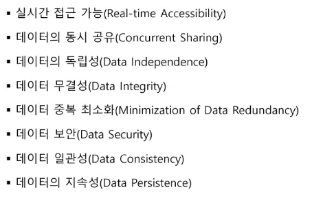

# 1. 데이터검색_함수1(20250310)

## ▶️ DataBase

### DataBase

- 특정 시스템 내에서 기능을 운영하기 위해 다수의 사용자들이 공유할 수 있도록 통합시키고 컴퓨터 저장 장치에 저장시킨 데이터의 집합
- 주요 특징
    
    
    

### DBMS

- DataBase Management System.

### 관계형 데이터베이스(RDBMS)

- 관계형 모델을 지원하는 DBMS
- 구성요소
    - 개체(Entity) → 테이블(Table)
    - 관계(Relationship) → 외래키(Foreign Key)
    - 속성(Attribute) → 열(Column)

### SQL

- Structured Query Language
- ANSI SQL을 사용하면 이 표준을 따른 모든 DBMS에서 사용 가능
    
    
    
- SQL구문의 종류
    - DML ( INSERT, UPDATE, DELETE, SELECT)
    - DDL ( CREATE, ALTER, DROP, RENAME)
    - TCL (COMMIT, ROLLBACK, SAVEPOINT)
    - DCL (GRANT, REVOKE)

## ▶️ SQL-데이터 검색(Select)

### Select구문

- 테이블에 저장되어 있는 데이터 조회
- 기본 구
    - SELECT절
    - FROM절
- 열 별칭 활용(as)
- 중복 행 제거(distinct)
- 선택적 데이터 조회(WHERE절)
- 비교 연산자
- 논리 연산, NULL과 논리 연산
- 비트 연산자
- CASE 연산자
- 정렬(ORDER BY절)
- 행 결과 제한(LIMIT절)

## ▶️ 내장함수

### 내장함수

- 함수의 처리 과정에 따라 단일 행 함수, 다중 행 함수로 구분
- 단일 행 함수
    - 숫자,문자,날짜,변환,기타
- 다중 행 함수
    - 집계함수(count, max, min, avg, sum)
    - 윈도우 함수

## ▶️ 내장함수 - 단일 행 함수

---

# 보충

- 실제 데이터는 table 이 아니라 attribute에 있는 것
- 단일 행 함수 = 데이터가 10번이면 함수를 통한 결과데이터도 10번
- 다중 행 함수 = 데이터가 10번이면 함수를 통한 결과데이터가 1번
    - count, max, min,avg,sum

|  | 가능 | 불가능 |
| --- | --- | --- |
| 다중 행 + 단일 행 |  | O |
| 다중 행 + 다중 행 | O |  |
| 단일 행( 단일 행) | O |  |
| 다중 행( 다중 행) |  | O |
