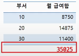
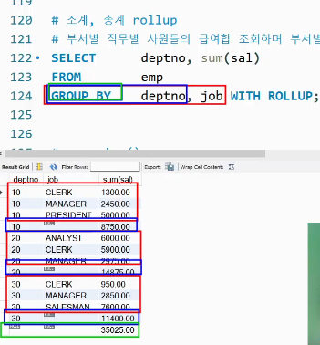

# 2. 함수2, Join(20250311)

## ▶️ 내장 함수 - 집계 함수

- 집계 함수의 종류
    - NULL값을 집계하지 않음에 주의
        - COUNT(*) 제외
    - COUNT([DISTINCT | ALL] 컬럼명 [,컬럼명,  ])
    - SUM([DISTINCT | ALL] 컬럼명 ) ,AVG,MAX,MIN
- GROUP BY절
    - 각 그룹별로 SELECT절에 기술한 집계 함수가 적용
    - WHERE절에는 집계 함수를 사용할 수 없음 ⇒ 집계결과 활용해서 filtering ⇒ having절
    - GROUP BY절에 작성된 SELECT절은 단일행으로 와야함
- 다중칼럼을 이용한 다중화
- HAVING절
- WITH ROLLUP
    - GROUP BY dento, job WITH ROLLUP;
        - dento 기준 with rollup 하나
        - dento , job 기준 with rollup 하나
        - 총 두개






- GROUPING함수
    - 실제 NULL값 또는 NULL값이 아닌 값
        - 0 리턴
    - ROLLUP에 의한 NULL값
        - 1리턴
- 피봇 테이블(Pivot Table)

## ▶️ 조인

### 조인(JOIN)

- 하나의 SQL 명령문으로 여러 테이블에 저장된 데이터를 한번에 조회할 수 있는 기능
- 조인의 종류 -1
    - 조건에 따른 구분
        - EQUI JOIN = INNER JOIN
        - NON - EQUI JOIN
    - 조인 처리 결과에 따른 구분
        - INNER JOIN : 조인 조건에 부합하는 행들만 연결하여 결과
        - OUTER JOIN : 조인 조건에 부합하지 않는 기준테이블의 행들도 모두 포함
- 조인의 종류 -2
    - 조인 조건 생략 시 구분
        - NATURAL JOIN : 두 테이블 연결 역할, 공통컬럼(이름 같아야함)
        - CROSS JOIN : 대상 테이블의 모든 행들을 가능한 조합으로 연결
            - ex) table 8개 행, table 4개 행 ⇒  32개의 행 결과 생성
    - 그 밖의 조인
        - SELF JOIN : 계층형의 성질을 갖는 데이터를 갖은 테이블에서 상/하 관계의 행을 연결하여 결과를 생성( 부하 - 상사 데이터)

### EQUI JOIN

- USING ⇒ 두 테이블에 이름이 같은 공통컬럼이 있어야함, 테이블 별칭 사용 불가!
- ON       ⇒ 조건 기술

```sql
# 사원이름과 부서이름, 부서번호 조회 (using)
SELECT ename, dname deptno
FROM emp 
JOIN dept  using(deptno);

# 사원이름과 부서이름, 부서번호 조회 (on)
SELECT ename, dname deptno
FROM emp A
JOIN dept B on(A.deptno=B.deptno);

------------------------------------------

# 직무가 CLERK인 사원이름과 부서이름, 부서번호 조회 (using)
SELECT ename, job, dname
FROM emp 
JOIN dept USING(deptno)
WHERE job = "CLERK";

# 사원이름과 부서이름, 부서번호 조회 (on)
SELECT ename, job, dname
FROM emp a
JOIN dept b on(a.deptno=b.deptno and job="CLERK");
```

### NON - EQUI JOIN

```sql
select E.ename, E.sal , S.grade
from emp E
join salgrade S on(E.sal between S.losal and S.hisal); 
```

### INNER JOIN

### OUTER JOIN

- 조인 조건에 부합하지 않는 행도 모두 포함하는 조인 방식
    - LEFT OUTER JOIN : 기준 테이블을 먼저 기술
    - RIGHT OUTER JOIN : 기준 테이블을 나중에 기술

```sql
SELECT ename, dname, grade
FROM emp E
LEFT JOIN dept D ON (E.emptno= D.deptno)
LEFT JOIN salgrade S ON (E.SAL BETWEEN S.LOSAL AND S.HISAL);
```

### NATURAL JOIN

- 조건 없이 자동으로 동일한 컬럼을 기준으로 조인
- 자동으로 되기 때문에 어떤 컬럼이 조인되는지 명확하게 인지해야 함
- 같은 컬럼이 없으면 조인 불가능

```sql
SELECT ename, dname
FROM emp
NATURAL JOIN dept;
```

### CROSS JOIN

```sql
SELECT ename, dname
FROM emp
CROSS JOIN dept;
```

### SELF JOIN

---

# 보충

---

year(hiredate) == extract(year from hiredate)
