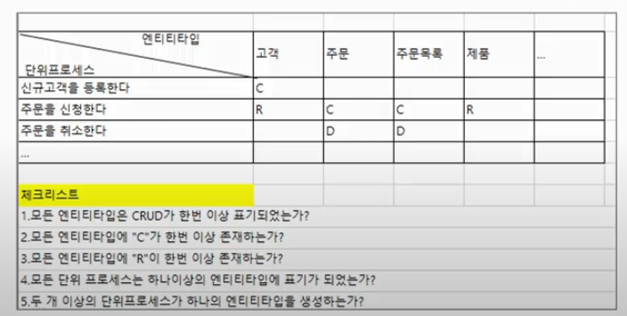

# 4. DB : Modeling

## ▶️ 데이터베이스 모델링

### Modeling

- 모형을 만드는 일
- 실재하는 현상을 간단한 형태로 나타내어 이를 기술하거나 예측하기 위한 기법

### DataBase Modeling

- 현실 세계의 데이터를 체계적으로 분석하여 데이터베이스의 구조를 설계하는 과정
- 데이터 무결성 유지
- 중복 최소화
- 효율적인 데이터 검색
- 유지보수 용이

### DataBase Modeling 과정

1. 요구사항 수집 및 분석
2. 개념적 데이터 모델링
    1. 개념 ERD 작성
3. 논리적 데이터 모델링
    1. 정규화
    2. 논리 ERD 작성
4. 물리적 데이터 모델링
    1. 역정규화
5. 데이터베이스 구축

## ▶️ 요구사항 수집 및 분석

### 요구사항 수집

- 구축하고자 시스템을 위한 요구사항에 관련된 다양한 자료를 수집
    - 문서, 시스템, 워크샵 및 인터뷰 , 설문조사, 프로토타이

### 요구사항 분석

- 수집된 정보들을 분석하여 데이터베이스의 용도를 파악
- 산출물
    - 요구 사항 명세서
    - 도메인 용어 사전

## ▶️ 개념적 데이터 모델링

### 개념적 데이터 모델링

- 다른 사람들이 이해하기 쉬운 형태로 표현
- 개체(엔티티), 속성, 관계를 정의
- 개체 - 관계 모델이 가장 많이 사용
    - 개체(엔티티)
    - 속성
    - 관계
- 산출물
    - 개념 ERD

### 개체(Entity)

- 시스템에서의 물리적, 개념적 대상
    - ex) 사원, 상품 (물리) ——————-부서 ,주문 (개념)
- 분석한 정보를 토대로 명사형으로 추출   ⇒ Entity 후보, 속성의 후보

### 개체(Entity)의 유형

- 유/무형에 따라
    - 유형 엔티티 : 물리적 형태
        - ex)사원, 상품
    - 개념 엔티티 : 물리 x , 개념정 정보
        - ex) 부서, 장소
    - 사건 엔티티 : 태초에는 없지만, 업부 수행함에 발생
        - ex) 주문, 청구
- 발생 시점에 따라
    - 기본 엔티티(Key Entity) : 독립적 생성 가능 엔티티
        - ex) 사원, 상품
    - 중심 엔티티(Main Entity) : 기본 엔티티에서 업무의 중심적인 역할
        - ex) 주문, 청구 계약
    - 행위 엔티티(Active Entity) : 중심 엔티티에서 더 세부적인 정보
        - ex) 주문 목록, 계약 진행

### 개체(Entity) 검증

- CRUD Matrix 상관관계 분석
    
    
    

### 속성(Attribute)

- 하나의 엔티티에 종속되는 명사적 단어

### 속성(Attribute)의 유형

- 기본 속성
- 설계 속성
- 파생 속성

정규화에서 중요!!  ⇒ 데이터의 중복을 제거해가는 과정, 키속성과 함수적 종속

### 키 (Key) 속성 추출

- 엔티티를 유일하게 식별하는 하나 이상의 속성 조합, 단 하나의 식별자
- 키(Key)의 유형
    - 슈퍼 키(Super Key)
        - 레코드를 유일하게 식별할 수 있는 모든 속성들의 가능한 조합의 집합
    - 후보 키(Candidate Key)
        - 슈퍼 키 중 최소성 만족
        - 여러개 가능
    - 기본 키(Primary Key)
        - 후보 키 중 가장 적합한 하나의 키
    - 대체 키(Alternate Key)
        - 후보 키 중 기본키로 선택 안된 키
    - 인조 키(Articifial Key)
        - 슈퍼키가 없어서 인공적으로 만든

### 관계(Releactionship)

- 두 엔티티 간의 업무적 상관 관계

### 관계(Releationship) 추출

- 요구사항 분석에서 동사적 단어 추출
- 두 엔티티 간의 중복되는 속성 체

### 관계 차수(Cardinality) 정의

- 관계의 유형
    - 1 : 1 관계 : 한 엔티티의 한개의 레코드가 다른 엔티티의 한개의 레코드에 연결
    - 1 : N 관계
    - N : M 관계

### 개념 ERD 작성

- 피터 첸 표기

## ▶️ 논리적 데이터 모델링

### 논리적 데이터 모델링

- 개념적 데이터 모델링의 결과인 ER모델을 구체화된 업무 중심의 관계형 데이터 모델로 만듦
    
    
    
- 정규화
- 산출물
    - 논리 ERD : 릴레이션 스키마

### 기본 키 정의

- 후보 키 중 가장 적합한 하나의 키

### N:M관계 해소

- 관계를 릴레이션으로 도출해서 1:N의 관계로 풀어냄

### 외래 키 정의

- 관계 차수에 따른 부모, 자식 릴레이션 확인 후 자식 릴레이션 쪽에 외래키 추가

### 정규화(Normalization)

- 릴레이션에서 중복을 최소화, 데이터 무결성 유지를 위해 새로운 엔티티를 도출
- 장점
    - 공간 절약, 성능개선
    - 데이터 무결성 유지
    - 데이터 삽입/수정/삭제 이상(Anomaly) 방지
- 단점
    - 물리적 접근 복잡
    - 길이 짧은 데이터 생김

### 제 1정규화(First Normal Form, 1NF)

- 비정규 릴레이션 → 제 1 정규형
    - 모든 속성이 원자값(Atomic Value)
    - 다치 속성을 갖는 릴레이션이 대상
        
        
        

### 제2정규화(Second Normal Form, 2NF)

- 제 1 정규형 ⇒ 제 2 정규형
    - 1NF를 만족
    - 부분적 함수 종속을 제거
        
        
        

### 제3정규화(Third Normal Form, 3NF)

- 제 2 정규형 ⇒ 제3 정규형
    - 2NF를 만족해야함
    - 이행적 함수 종속을 제거
        
        
        
        
        

## ▶️ 물리적 데이터 모델링

### 물리적 데이터 모델

- 논리 모델링 결과를 실제 데이터베이스 환경에서 구현 가능한 형태로 변화
- 역정규화(Denormalization)
- 산출물
    - 물리 ERD

### 역 정규화

- 정규화된 데이터를 성능 향상을 위해 일부 중복을 허용하거나 다시 합치는 과정
- 쿼리 성능 최적화, 조인 비용 절감이 목적
- 테이블 조회 성능을 개선하지만, 데이터 일관성 관리가 어려워질  수 있음
- 테이블 개수가 줄어듬