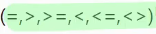

# 3. SubQuery(20250312)

## ▶️ 서브 쿼리(Sub Query)

### 서브 쿼리

- 하나의 쿼리가 다른 SQL문에 포함되는 구조
- 하나의 쿼리의 결과를 다른 SQL문에 전달
- 주의 사항
    - 괄호 ( )
    - 끝에 ; 붙이지 않음
    - ORDER BY절 제한, 의미 없는 경우가 있음

### 서브 쿼리(Sub Query)의 유형

- 단일 행 서브 쿼리
    - 서브 쿼리에서 하나의 행만을 조회
    - 단일 행 비교 연산자
        
        
        
        ```sql
        SELECT ename, deptno
        FROM emp
        WHERE deptno = (
        SELECT deptno
        FROM emp
        WHERE ename = 'SMITH'
        );
        ```
        
        
        
- 다중 행 서브 쿼리
    - 서브 쿼리에서 여러 행을 검색 , 반환
    - 다중 행 비교 연산자
        
        
        
    
    ```sql
    SELECT empno, ename , '관리자'
    FROM emp
    WHERE empno IN (
    SELECT mgr
    FROM emp
    );
    ```
    
    
    

## ▶️ 다중 행 서브 쿼리(Sub Query) 연산

### 다중 행 서브 쿼리 비교 연산자

- IN
- ANY
    - 목록값 중 적어도 1개보다 큰 / 작은
    
    ```sql
    # 안쓴버전
    SELECT ename, sal
    FROM emp
    WHERE sal >  (SELECT MIN(sal)
    						FROM emp
    						WHERE job = 'salesman');
    
    # ANY 쓴 버전
    SELECT ename, sal
    FROM emp
    WHERE sal > ANY (SELECT sal
    								FROM emp
    								WHERE job = 'salesman');
    ```
    
    ```sql
    # salesman의 급여보다 많은 사원 중 최소값 비교
    SELECT ename, sal
    FROM emp
    WHERE sal > ANY (SELECT sal
    								FROM emp
    								WHERE job = 'salesman');
    );
    
    # salesman의 급여보다 적은 사원 중 최대값 비교
    SELECT ename, sal
    FROM emp
    WHERE sal < ANY (SELECT sal
    								FROM emp
    								WHERE job = 'salesman');
    ```
    
- ALL
- EXISTS (상관관계 서브쿼리 상호관계 서브쿼
    - 서브쿼리에서 검색된 결과가 하나라도 존재하면 메인 쿼리 조건절이 참
    - 만족하는 행이 존재하면 바로 참 반환
    - SEMI JOIN
        
        ```sql
        SELECT empno, ename , '관리자' AS 구분
        FROM emp E
        WHERE EXISTS (SELECT 1
        							FROM emp E2
        							WHERE E.empno = E2.mgr);
        ```
        
        ```sql
        SELECT DISTINCT E.empno, M.ename , '관리자' AS 구분
        FROM emp E
        JOIN emp M ON ( E.empno = M.mgr);
        ```
        
        
        

## ▶️ 서브 쿼리(Sub Query) 활용

### 상호 연관(Correlative) 서브 쿼리

- Main 쿼리와 별도로 독립적인 실행이 불가능한 쿼리

### 다중 열 서브 쿼리

- 여러 열을 조회하는 서브 쿼리

```sql
select ename, sal deptno
from emp
where (deptno, sal) in( 
select ifnull(deptno,' '), max(sal)
from emp 
group by deptno
);
```

### 스칼라(Scalar) 서브 쿼리

- 단 하나의 값 만을 조회하는 서브 쿼리
- 단일 행 단일 행
- 하나의 값만이 요구되는 위치에 사용 됨

### 인라인 뷰

- FROM 절 또는 JOIN절 뒤에 위치하는 서브 쿼리
- 서브 쿼리의 실행 결과 집합을 마치 테이블처럼
- 일회성 뷰(VIEW)

## ▶️ 집합 연산

### 집합 연산

- 쿼리 실행 결과를 하나의 집합으로 보고 집합 간의 연산을 수행 할 수 ㅣㅆ음
- 연산자
    - UINION ALL ( 합집합 , 중복 행 포함)
    
    ```sql
    SELECT member_id, 'Order' AS activity_type
    FROM orders
    UNION ALL
    SELECT member_id, 'Event Registraction' AS activity
    FROM event_registrations;
    ```
    
    - UNION (합집합, 중복 행 제거)
    
    ```sql
    SELECT member_id
    FROM orders
    UNION
    SELECT member_id
    FROM event_registrations;
    ```
    
    - INTERSECT ( 교집합)
    
    ```sql
    SELECT member_id
    FROM orders
    INTERSECT
    SELECT member_id
    FROM event_registrations;
    ```
    
    - EXCEPT (차집합)
        - 먼저 기술된 앞쪽 쿼리가 기준 집
        
        ```sql
        SELECT member_id
        FROM orders
        EXCEPT
        SELECT member_id
        FROM event_registrations;
        ```