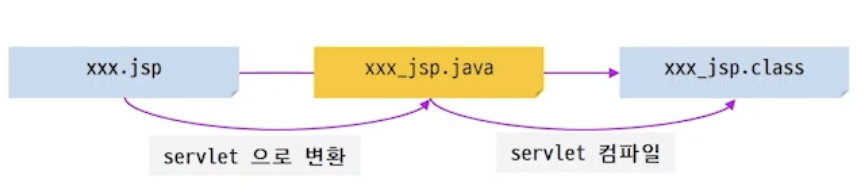

# Web(back) : JSP,EL/JSTL

## ▶️ JSP

- 기존 Servlet의 문제점을 해소하기 위해!

```sql
protected void gugu(http~~)
Stringbuilder html = new StringBuilder(
"""
<html>
<body>
<table>

""");
```

- JSP
    - Servlet이 java 코드 사이에 HTML태그를 작성했다면
    - JSP는 HTML 태그 기반에 java 코드를 작성하는 성태
- JSP의 동작 원리
    - JSP는 중간단계! 최종은 Servlet
        
        
        

### JSP 구성요소

| directive | <%@[directive] 속성=”값” 속성=”값  ‘’’%> |
| --- | --- |
| page | jsp 페이지에 대한 기본 정보 지정 |
| taglib | 사용할 태그 라이브러리 지정 |
| include | 특정 영역에 다른 문서 포함 |

### JSP 스크립트 요소

- script-let : <% [ 자바 실행문] %>
- declaration : <%! [멤버 변수 또는 메서드] %>
- expression : <%= [ 출력 할 내용] % >
- comment : <%—[주석내용]—%>

### JSP 내장객체

- request, response, out, session, application
- 추가적인 속성(attribute)저장을 위한 웹의 영역(scope)
    - page scope
        - 페이지내에 속성 저장, 페이지 종료되면 소멸
        - Servlet : 없음
    - request scope
        - 요청처리동안, 요청 완료되면 소멸
        - Servlet : doGet, doPost 인 HttpServletRequest request
    - session scope
        - 웹 애플리케이션에 접속한 동안, 종료하면 소멸
        - Servlet : HttpSession session = request getSession();
    - application scope
        - 웹 애플리케이션 전체에 걸쳐 속성 저장,모든 사용자와 세션에 공유
        - Servlet : ServletContext application = getServletContext();

### EL & JSTL

- EL
    - 출력을 위한 언어로 JSP의 expression (<%=…%>)대체
    - 웹 스코프에 저장된 attribute를 사용하는데 매우 편리
- JSTL
    - 자주 사용되는 기능들에 대해 정형화된 태그 사용
    - 별도의 라이브러리 추가 설치 필요

### EL


- 기본
    - 출력을 위한 언어로 JSP의 expression (<%=…%>)대체
    - 4가지 웹 스코프에 저장된 attribute를 사용하는데 매우 편리
    - 작은 범위에서 큰 범위로 확장하며 attribute의 검색
        - 처음 발견된 값 활용
        - 값이 없을 경우 null이 아닌 공백
    - javascript템플릿 문자열에서 사용된 $와 혼용 주의
- 내장 객체
- 객체 접근 방법
    - JavaBeans의 property에 사용할 때 set/get을 제외하고 첫 글자를 소문자로 접근
    - Map 계열은 key이름으로 접근
    - Java Beans?
        - cammelCase 로 쓰기
        - setter/getter를 제공
        - 기본 생성자 포함
- 자바와 다른 점
    - + 지원하지 않음
    - 나누기 에 대해 소수점의 결과를 리턴
    - empty 값이 true로 평가받는 경우
        - null, 빈 문자열, 길이가 0인 배열, 빈 Collection 객체

### JSTL

- 기본
    - Tag Library
        - 사용자 정의 태그
    - JSP Standard Tag Library
        - Tag Library 중 자주 사용되는 기능을 모아서 제공하는 태그 모음
        - 주로 EL과 함께 사용
    - 라이브러리 설치
- JSTL 사용 선언
    - taglib directive 활용
        - prefix : 내가 만든 태그 쓸 때 붙이기
        - url : prefix 경로

```sql
<%@ taglib prefix = "c" uri = "jakarta.tags.core" %>
```

- JSTL - Core
    - 변수 지원
        
        
        | <c:set> | <c:set var=”변수명”  value=”값” [scope=”영역”]/> |
        | --- | --- |
        | <c:remove> | <c:remove var=”변수명” scope=”request”/> |
    - 조건문
        
        
        | <c:if> | <c:if test=”조건”  [var=”test_result]></c:if> |
        | --- | --- |
        | <c:choose> | <c:choose>  </c:choose> |
        | <c:when> | <c:when test=”…”>….</c:when> |
        | <c:otherwise> | <c:otherwise>유아</c:otherwise> |
    - 반복문
        
        
        | <c:forEach> | <c:forEach var = “변수명” items=”대상컬렉션” varStatus=”status”> … </c:forEach> |
        | --- | --- |
